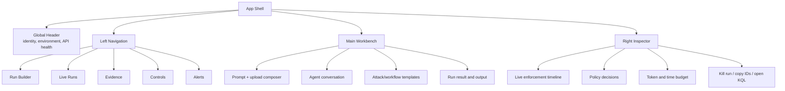

# Updated Dataflow and App Design

Date: 2026-05-26

This design reflects the current repo shape: a containerized React frontend, FastAPI orchestrator, OPA policy runtime, ephemeral Container Apps agent jobs, App Configuration kill switches, Log Analytics evidence, and Sentinel/Security.microsoft.com triage.

> **Recent additions (Phases 1–7):** layered prompt-injection defense (`app/prompt_shield.py`), agent-to-agent delegation trust (`app/delegation.py`), ISO 42001 / NIST AI RMF governance metadata (`app/governance/`), statistical anomaly scoring (`app/anomaly.py`), DSAR purge endpoint (`app/dsar.py`), MCP server and client (`app/mcp_server.py`, `app/mcp_client.py`), excessive-agency / loop / cost guardrails (`policies/excessive_agency.rego`, `app/loop_detection.py`, `app/pricing.py`), and the consolidated SOC workbook definition at [../infra/workbooks/soc-workbook.json](../infra/workbooks/soc-workbook.json). See [./audit-pipeline-troubleshooting.md](./audit-pipeline-troubleshooting.md) for diagnosing audit pipeline issues.

Related implementation anchors:

- Frontend shell: [../frontend/src/App.tsx](../frontend/src/App.tsx)
- Current chat workspace: [../frontend/src/components/AgentChatWorkspace.tsx](../frontend/src/components/AgentChatWorkspace.tsx)
- SSE hook: [../frontend/src/hooks/useSSE.ts](../frontend/src/hooks/useSSE.ts)
- Orchestrator routes: [../app/main.py](../app/main.py)
- Agent loop: [../app/agent.py](../app/agent.py)
- Audit schema: [../app/models/audit_event.py](../app/models/audit_event.py)
- Deployment entry point: [../infra/main.bicep](../infra/main.bicep)
- Diagram source: [./ai-security-sandbox-dataflow.excalidraw](./ai-security-sandbox-dataflow.excalidraw)

## Design Goals

1. Make the app feel like an operator console, not only a chat demo.
2. Preserve the core security story: gateway control, runtime policy, sandbox enforcement, evidence, and SOC handoff.
3. Give every run a visible chain of custody from request intake through OPA decisions, tool execution, audit events, and Sentinel alerts.
4. Keep the demo simple enough for leadership, but detailed enough for security engineers to trust.
5. Align frontend navigation with backend surfaces that already exist: runs, SSE streams, timelines, alerts, kill switches, approvals, and run termination.

## Updated Dataflow

```mermaid
flowchart LR
    Operator[Operator / analyst browser] -->|MSAL sign-in| Entra[Microsoft Entra ID]
    Operator -->|HTTPS| Frontend[Frontend Web App\nReact + Nginx]

    Frontend -->|POST /sandbox/runs\nGET /sandbox/stream/runs/{id}| ApiGateway[APIM /sandbox\nJWT, rate limit, quota\ncorrelation ID]
    ApiGateway -->|inject gateway header| Orchestrator[FastAPI Orchestrator\nWeb App]

    Orchestrator -->|check flags| AppConfig[Azure App Configuration\nkill switches]
    Orchestrator -->|create run task| Runner[Ephemeral Agent Runner\nContainer Apps Job]
    Runner -->|sidecar policy checks| OPA[OPA policy runtime\nRego bundle]
    Runner -->|managed identity inference| AzureOpenAI[Azure OpenAI / Foundry model]
    Runner -->|read/write virtual paths| WorkspaceSA[Workspace Storage\nephemeral run data]

    Runner -->|approval request| LogicApp[Logic App approval workflow]
    LogicApp -->|signed callback| Orchestrator

    Runner -->|AuditEvent JSON| AuditLogger[Audit Logger]
    AuditLogger -->|live events| SSE[SSE queue]
    SSE --> Frontend
    AuditLogger -->|DCR ingestion| LogAnalytics[Log Analytics\nAiAgentAudit_CL]
    AuditLogger -->|append JSONL| WormBlob[Audit Storage\nWORM append blob]
    LogAnalytics --> Sentinel[Microsoft Sentinel rules]
    Sentinel --> Defender[Security.microsoft.com\nincident triage]
```

### 1. Authentication and App Bootstrap

The operator opens the frontend Web App. When authentication is enabled, the React shell uses MSAL to acquire a Microsoft Entra token before exposing the workspace. The frontend sends authenticated API requests using `useAuthHeaders`.

The deployed production path keeps browser API traffic behind APIM so JWT validation, quota, rate limiting, and correlation headers are consistently applied. The frontend image is built with `VITE_API_BASE=https://<apim-gateway>/sandbox`; same-origin `/api` and `/sandbox` paths on the frontend host intentionally return an error instead of proxying to the orchestrator.

APIM injects `X-Orchestrator-Gateway-Secret` before forwarding to the orchestrator. In deployed environments the orchestrator requires that header for normal API routes, so direct public calls to the orchestrator Web App fail before reaching run intake. `/health` remains available for platform probes, and approval callbacks continue to use their callback token.

### 2. Run Intake

A run starts through `POST /runs` with JSON or multipart form data. The orchestrator assigns a run ID, stores initial run metadata, creates an SSE queue, checks the agent-type kill switch, and starts background execution.

Key controls at intake:

- APIM validates JWTs and applies request limits.
- APIM injects the orchestrator gateway header required by backend middleware.
- Orchestrator middleware propagates `X-Correlation-ID`.
- Orchestrator kill switch middleware blocks execution when global execution is disabled.
- In-process rate limiting backs up APIM.
- Input preflight scans task text and uploaded content for deterministic policy violations before model execution.

### 3. Workspace and Input Staging

For each run, the orchestrator opens an `EphemeralWorkspace`. Uploaded files are staged into the run workspace, read back for scanning, and added to the task as untrusted context. If storage staging is unavailable, the content can still be policy-scanned from the upload stream, and the staging failure is audited.

The agent only receives virtual paths such as `/workspace/{run_id}/write/{filename}`. Storage account URLs and credentials are never surfaced to the model.

### 4. Agent Execution Loop

The agent loop repeats until the model finishes, the token budget is exhausted, the time limit is reached, a policy failure blocks execution, or an operator kills the run.

For every iteration:

1. Check global, agent-type, and capability kill switches.
2. Check token budget for the configured agent type.
3. Run prompt-shield scans on the task and any retrieved/RAG content (`prompt_shield_scan`, `retrieved_content_scan`) and abort on hard signals (LLM01).
4. Authorize the Azure OpenAI call through OPA.
5. Call the model using managed identity.
6. Parse tool calls.
7. Enforce the Python capability manifest (including delegation trust + excessive-agency rules).
8. Authorize the specific action through OPA.
9. Request human approval for high-risk actions.
10. Execute the tool in the sandbox (or proxy via the MCP client for MCP-tagged tools).
11. Score the call with the statistical anomaly model (`anomaly_ml_score`) and check the loop detector + cost ceiling (`loop_detected`, `cost_threshold_breach`).
12. Emit audit events for policy decisions, tool results, file hashes, destinations, token counts, governance attestation, and outcomes.

### 5. Approval Dataflow

When OPA returns `requires_approval`, the agent posts a request to the Logic App approval workflow with run metadata, action details, risk score, correlation ID, and a callback token. The agent waits for the signed callback on `POST /runs/{run_id}/approve` and resumes only after approval. Timeout or missing approval fails closed.

### 6. Evidence Dataflow

Every meaningful action emits an `AuditEvent` with a stable schema. Events flow to four consumers:

- Stdout/container logs for operational debugging.
- SSE queue for live UI updates.
- Log Analytics through DCR ingestion for KQL, detection, and timeline retrieval.
- WORM append blob for tamper-evident retention.

The UI should treat SSE as the live view and `GET /runs/{run_id}/timeline` as the post-run source of truth. When Log Analytics is not wired up, the timeline endpoint already falls back to the local in-memory event cache.

The `AuditEvent` schema in [../app/models/audit_event.py](../app/models/audit_event.py) now includes Phase 1–7 fields:

- `parent_agent_id`, `call_chain` — agent delegation provenance.
- `governance_metadata_ref` — pointer to the ISO 42001 / NIST AI RMF model card.
- `injection_score`, `anomaly_score` — ML-style scoring for prompt shield and anomaly detection.
- `tool_namespace` — MCP tool identifier (`mcp://server/agent/tool`).
- `confirmation_token` — binds approvals to specific actions.
- `estimated_cost_usd` — emitted on `openai_call` and aggregated for `cost_threshold_breach`.

New `ActionType` values introduced in this batch: `prompt_shield_scan`, `retrieved_content_scan`, `agent_spawn`, `agent_delegation`, `governance_attestation`, `anomaly_ml_score`, `dsar_purge`, `mcp_tool_call`, `mcp_tool_discovery`, `excessive_agency_block`, `loop_detected`, `cost_threshold_breach`.

### 7. SOC Handoff

Sentinel rules query `AiAgentAudit_CL` for repeated denies, OPA availability failures, run failure spikes, token spikes, and kill switch activity. Security.microsoft.com is the incident workflow surface for triage, assignment, notes, and closure. The app should provide run IDs, correlation IDs, KQL, and deep-link copy affordances, but should not try to replace the SOC incident console.

The canonical SOC dashboard is the workbook defined in [../infra/workbooks/soc-workbook.json](../infra/workbooks/soc-workbook.json) and deployed by [../scripts/deploy-sentinel-workbook.ps1](../scripts/deploy-sentinel-workbook.ps1) / [../scripts/deploy-sentinel-workbook.sh](../scripts/deploy-sentinel-workbook.sh). It exposes filterable panels for the Phase 1–7 controls (prompt shield, delegation, MCP, anomaly, cost) alongside the original policy / DLP / content-safety panels.

## Updated App Design

Working title: **Secure Agent Operations Console**

The updated app should keep the current chat-first speed, but wrap it in an operations layout that makes enforcement visible.



### Information Architecture

| Area | Purpose | Backing API/data |
|---|---|---|
| Run Builder | Compose a task, choose agent type, attach a file, preview capability profile, start run | `POST /runs`, attack/workflow templates |
| Live Run | Show chat transcript, status, uploaded file, run result, and live execution state | `GET /runs/{run_id}`, `GET /stream/runs/{run_id}` |
| Enforcement Timeline | Show each policy check, kill-switch check, OpenAI call, file action, network call, approval, and completion | SSE `AuditEvent[]` |
| Evidence | Show post-run timeline, KQL query, source (`log_analytics` or `local_cache`), hashes, destinations, and error codes | `GET /runs/{run_id}/timeline` |
| Controls | Show and toggle kill switches, with impact labels and last-known state | `GET /kill-switches`, `PUT /kill-switches/{flag}` |
| Alerts | Show recent Sentinel alerts and map them back to run IDs/correlation IDs where possible | `GET /alerts` |
| Operator Actions | Kill a run, copy run ID/correlation ID, download evidence JSON, copy KQL | `DELETE /runs/{run_id}`, timeline response |

### Primary Screen Layout

Use a dense SOC-console layout rather than a marketing page.

- Header: product name, signed-in operator, environment badge, API connectivity, auth state.
- Left rail: icon navigation for Run, Evidence, Controls, Alerts.
- Main pane: run builder and chat transcript.
- Right pane: enforcement timeline with compact badges for `allow`, `deny`, `requires_approval`, `blocked`, `failure`, and `success`.
- Bottom evidence drawer: expandable KQL and raw event JSON for the selected run.

### Run Builder

Controls:

- Agent type segmented control: `data-analyst` and `web-researcher`.
- Capability preview: allowed tools, egress destinations, token budget, max duration.
- Prompt editor with length meter.
- File picker with accepted file hints and staged filename preview.
- Template menu for repeatable demo scenarios.
- Start button that creates the run and immediately opens the SSE stream.

Expected states:

- Idle: ready to start.
- Queued: run accepted, SSE connecting.
- Running: stream connected, timeline updating.
- Awaiting approval: approval event pinned at top of timeline.
- Completed: final output shown, timeline switches to evidence mode.
- Failed/blocked: error callout includes policy reason or kill-switch flag.
- Killed: operator reason shown in result area.

### Live Enforcement Timeline

Each event row should show:

- Timestamp.
- Action type icon.
- Policy decision badge.
- Outcome badge.
- Path or destination when present.
- Token count when present.
- Risk score when present.
- Error code when present.
- Correlation ID available through copy action, not repeated in every row.

The timeline should group repeated policy checks and preserve raw event access for audit use.

### Evidence View

The evidence view should be optimized for the demo handoff from app to Azure.

Recommended sections:

- Run summary: run ID, correlation ID, agent type, status, timestamps.
- Decision summary: counts by action type, policy decision, and outcome.
- KQL panel: the exact query returned by the backend.
- Event table: sortable by timestamp, action type, decision, outcome, destination, path, and error code.
- Integrity panel: content hashes and WORM audit blob note.
- SOC pivot: copy run ID, copy correlation ID, copy KQL, open Azure portal/Security.microsoft.com links when environment values are configured.

### Controls View

Kill switches should be visible as operational controls, not buried settings.

Recommended grouping:

- Global: `agent-execution-enabled`.
- Capabilities: `file-write-enabled`, `network-egress-enabled`, `openai-calls-enabled`.
- Agent types: `agent-data-analyst-enabled`, `agent-web-researcher-enabled`.

Each row should show enabled/disabled state, scope, short impact, and a guarded toggle. Disabling should require a typed reason or confirmation in production mode, while demo mode can allow fast toggles.

### Alerts View

The app should show enough alert context to prove detection exists, but leave investigation workflow to Security.microsoft.com.

Recommended card fields:

- Alert name and severity.
- Status.
- Timestamp.
- Tactics/entities.
- Description.
- Related run IDs or correlation IDs when parsed from alert metadata.
- Copy KQL or open incident action when configured.

## API Contract Used by the Design

| Method | Route | Design use |
|---|---|---|
| `POST` | `/runs` | Create JSON or multipart agent run |
| `GET` | `/runs/{run_id}` | Poll run status and final result |
| `GET` | `/stream/runs/{run_id}` | Live audit event stream |
| `GET` | `/runs/{run_id}/timeline` | Post-run evidence timeline and KQL |
| `GET` | `/alerts` | Recent Sentinel alerts |
| `GET` | `/kill-switches` | Current feature flag states |
| `PUT` | `/kill-switches/{flag}` | Toggle feature flags |
| `POST` | `/runs/{run_id}/approve` | Logic App approval callback |
| `DELETE` | `/runs/{run_id}` | Emergency run kill |
| `GET` | `/health` | Connectivity and readiness |

## Recommended Implementation Phases

### Phase 1: Console Shell and Live Run View

- Refactor `AgentChatWorkspace` into a workbench with main chat and right-side timeline.
- Wire `useSSE` immediately after run creation.
- Add run status, token count, and event badges.
- Preserve the current simple send/upload workflow.

### Phase 2: Evidence and Controls

- Add Evidence view backed by `/runs/{run_id}/timeline`.
- Add Controls view backed by `/kill-switches` and `PUT /kill-switches/{flag}`.
- Add copy actions for run ID, correlation ID, and KQL.

### Phase 3: SOC and Gateway Polish

- Add Alerts view backed by `/alerts`.
- Keep the production API path pinned to APIM and fail builds that omit the APIM endpoint or Entra settings.
- Add Azure/Security portal deep links where tenant/subscription/workspace IDs are available.

## Design Decisions and Guardrails

- The app must never imply that an action was allowed just because the model requested it; only policy and audit events determine action state.
- Denied actions should be first-class successful security outcomes, not generic app errors.
- Approval pending is a durable run state in the UI even if the approval itself is handled by Logic App and Teams/email.
- The UI should not display secrets, blob SAS URLs, raw bearer tokens, or Key Vault references.
- Audit failures should be visible as warnings, but agent execution behavior should continue to follow the backend fail-closed conventions already defined in code.
- File names and virtual paths shown in the UI must be treated as untrusted text and rendered safely.

## Open Design Decisions

1. Runtime target: the repo currently contains both Container Apps and Web App orchestrator resources. Pick one public orchestrator target as the long-term source of truth, or document why both remain.
2. Approval UI: the current approval callback is designed for Logic App, but the console could show read-only pending approval state from audit events.
3. Evidence export: decide whether exports are local JSON downloads only, or also written to a governed storage location.
4. Alert correlation: Sentinel alert payloads may need normalized custom details so `/alerts` can reliably map alert cards back to run IDs.

## App Design Acceptance Criteria

- A user can start a run, watch live audit events, and see final output without leaving the app.
- Every displayed run exposes run ID and correlation ID.
- A denied or blocked action is visible as a first-class event, not only as a final error.
- The Evidence view shows the exact KQL used to retrieve the timeline.
- Kill switch state is visible and can be changed by an authorized operator.
- The app never implies that SOC triage happens inside the demo console; it pivots to Azure Security for incident workflow.
- Public API traffic uses the gateway controls in production.
